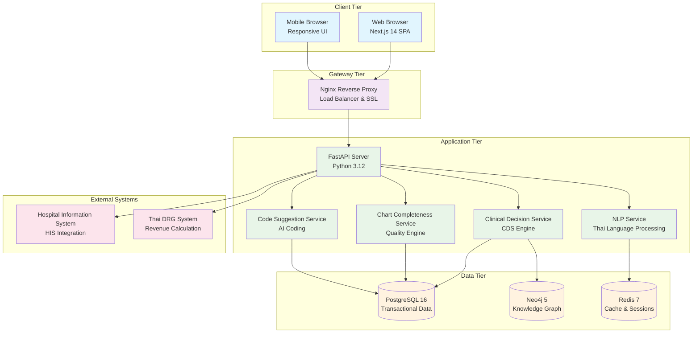
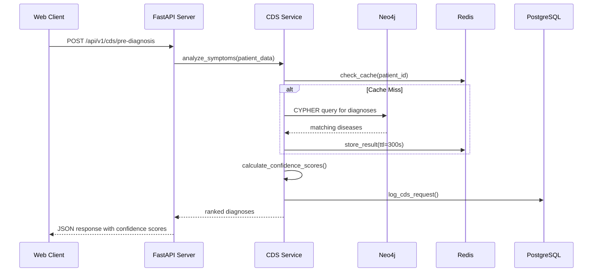
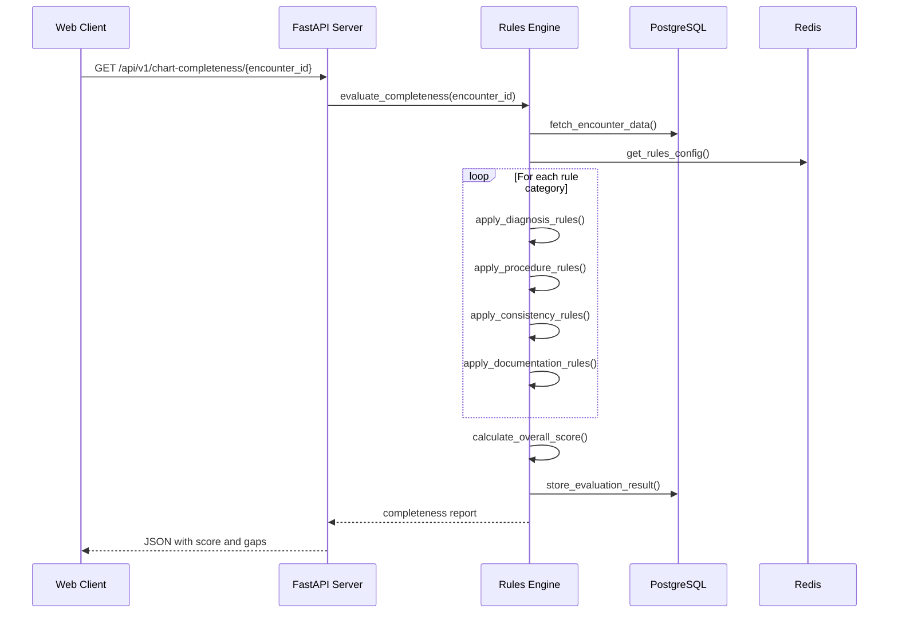

# 🏗️ ChartSense AI System Architecture

**Comprehensive Technical Architecture Documentation**

---

## Table of Contents

1. [System Overview](#system-overview)
2. [High-Level Architecture](#high-level-architecture)
3. [Service Architecture](#service-architecture)
4. [Data Architecture](#data-architecture)
5. [Component Interactions](#component-interactions)
6. [Security Architecture](#security-architecture)
7. [Deployment Architecture](#deployment-architecture)
8. [Performance Considerations](#performance-considerations)

---

## System Overview

ChartSense AI follows a **microservices-oriented architecture** built on modern containerized infrastructure. The system implements a **3-tier architecture** with clear separation of concerns between presentation, business logic, and data layers.

### Architectural Principles

- **API-First Design**: All functionality exposed through RESTful APIs
- **Containerized Services**: Docker-first development and deployment
- **Microservices Pattern**: Loosely coupled services with specific responsibilities
- **Event-Driven Processing**: Asynchronous handling of clinical workflows
- **Multi-Database Strategy**: Purpose-built data stores for different use cases

---

## High-Level Architecture



---

## Service Architecture

### Frontend Service (Next.js 14)

**Technology Stack**:
- Next.js 14.x with App Router
- TypeScript 5.x for type safety
- Tailwind CSS for styling
- shadcn/ui component library
- React 18.x with Server Components

**Key Components**:
- **App Shell** [`src/components/layout/AppShell.tsx`](../../frontend/src/components/layout/AppShell.tsx)
- **Sidebar Navigation** [`src/components/layout/Sidebar.tsx`](../../frontend/src/components/layout/Sidebar.tsx)
- **Patient Dashboard** [`src/app/patients/[id]/page.tsx`](../../frontend/src/app/patients/[id]/page.tsx)
- **Admin Panel** [`src/app/admin/page.tsx`](../../frontend/src/app/admin/page.tsx)

### Backend Service (FastAPI)

**Technology Stack**:
- FastAPI 0.115+ framework
- Python 3.12 runtime
- SQLAlchemy 2.x ORM
- Pydantic 2.x validation
- Uvicorn ASGI server

**Core Structure** [`backend/app/main.py`](../../backend/app/main.py:1-32):
```python
app = FastAPI(
    title="ChartSense AI",
    description="AI-Powered Clinical Decision Support Platform",
    version="1.0.0"
)

# API Route Registration
app.include_router(cds.router, prefix="/api/v1/cds")
app.include_router(chart.router, prefix="/api/v1/chart-completeness")
app.include_router(coding.router, prefix="/api/v1/code-suggestion")
app.include_router(admin.router, prefix="/api/v1/admin")
```

### Service Layer Architecture

#### Clinical Decision Support (CDS) Service
**File**: [`backend/app/services/graphrag.py`](../../backend/app/services/graphrag.py)

**Responsibilities**:
- Differential diagnosis generation using knowledge graph traversal
- Risk stratification with validated clinical scores (CURB-65, qSOFA)
- CPG-compliant order suggestions
- Admission decision support

**Core Algorithm**:
```python
def generate_differential_diagnosis(symptoms: List[str], patient_data: dict) -> List[Diagnosis]:
    """
    GraphRAG-based diagnosis generation:
    1. Query knowledge graph for symptom patterns
    2. Calculate similarity scores using clinical features
    3. Rank diagnoses by confidence and clinical relevance
    4. Apply patient-specific risk factors
    """
```

#### Chart Completeness Service
**File**: [`backend/app/services/rules.py`](../../backend/app/services/rules.py)

**Responsibilities**:
- Real-time chart quality assessment
- Multi-dimensional rule evaluation (20+ rules across 4 categories)
- Gap identification and ICD-10 code suggestion
- Quality trend tracking

**Rule Categories**:
1. **Diagnosis Rules** — ICD-10 coding completeness
2. **Procedure Rules** — CPT/procedure code validation
3. **Consistency Rules** — Cross-field data validation
4. **Documentation Rules** — Required clinical documentation

#### Code Suggestion Service
**File**: [`backend/app/services/drg.py`](../../backend/app/services/drg.py)

**Responsibilities**:
- AI-powered ICD-10 code recommendations
- DRG/RW impact calculation
- Revenue optimization analysis
- Medical coding workflow support

#### Thai NLP Service
**File**: [`backend/app/services/nlp.py`](../../backend/app/services/nlp.py)

**Responsibilities**:
- Thai language clinical text processing
- Medical entity extraction
- Keyword matching and normalization
- Clinical concept mapping

---

## Data Architecture

### Multi-Database Strategy

#### PostgreSQL 16 - Primary Transactional Database
**Schema**: [`backend/app/models/`](../../backend/app/models/)

**Core Entities**:
- **Patients** [`patient.py`](../../backend/app/models/patient.py) — Demographics and medical history
- **Encounters** [`chart.py`](../../backend/app/models/chart.py) — Clinical visits and documentation
- **Chart Completeness** — Quality scores and rule evaluations
- **Code Suggestions** [`coding.py`](../../backend/app/models/coding.py) — AI coding recommendations
- **Admin Configuration** [`admin.py`](../../backend/app/models/admin.py) — Rules and templates

#### Neo4j 5 - Knowledge Graph Database
**Purpose**: Medical knowledge representation and GraphRAG queries

**Graph Structure**:
```cypher
// Disease nodes with relationships
(Disease)-[:HAS_SYMPTOM]->(Symptom)
(Disease)-[:REQUIRES_LAB]->(LabTest)
(Disease)-[:RISK_FACTOR]->(RiskFactor)
(Disease)-[:CAN_CAUSE]->(Complication)
```

**Disease Groups Implemented**:
- Community-Acquired Pneumonia (CAP)
- Diabetes Mellitus Complications
- Heart Failure

#### Redis 7 - Caching Layer
**Purpose**: Session management, query result caching, and real-time data

**Cache Patterns**:
- **Session Storage** — User authentication and preferences
- **Query Result Cache** — GraphRAG query optimization
- **Real-time Metrics** — Chart completeness scores
- **API Rate Limiting** — Request throttling

---

## Component Interactions

### Clinical Decision Support Flow



### Chart Completeness Evaluation Flow



---

## Security Architecture

### Authentication & Authorization
- **Session-based Authentication** via Redis
- **CORS Configuration** for cross-origin requests
- **API Rate Limiting** to prevent abuse
- **Input Validation** using Pydantic schemas

### Data Security
- **Environment Variable Management** for sensitive configuration
- **Database Connection Pooling** with encrypted connections
- **Audit Logging** for all clinical actions
- **PHI Data Handling** with anonymization for demo mode

### Network Security
- **Nginx SSL Termination** for HTTPS encryption
- **Internal Service Communication** over Docker networks
- **Database Access Control** with user-specific credentials
- **Container Isolation** for service separation

---

## Deployment Architecture

### Docker Compose Configuration
**File**: [`docker-compose.yml`](../../docker-compose.yml:1-82)

**Service Dependencies**:
```yaml
services:
  nginx:     # Load balancer & SSL termination
    depends_on: [frontend, backend]
  
  frontend:  # Next.js application
    depends_on: [backend]
  
  backend:   # FastAPI server
    depends_on: [postgres, redis, neo4j]
  
  postgres:  # Primary database
    healthcheck: pg_isready
  
  redis:     # Cache layer
    healthcheck: redis-cli ping
  
  neo4j:     # Knowledge graph
    healthcheck: cypher-shell connection test
```

### Container Orchestration

#### Health Checks
- **PostgreSQL**: `pg_isready` connection validation
- **Redis**: `redis-cli ping` availability check
- **Neo4j**: `cypher-shell` authentication test
- **Backend**: `/api/v1/health` endpoint monitoring

#### Volume Management
- **postgres_data**: Persistent database storage
- **redis_data**: Cache persistence across restarts
- **neo4j_data**: Graph database persistence
- **Development Volumes**: Hot-reload for code changes

---

## Performance Considerations

### Database Optimization
- **PostgreSQL Indexing**: Critical queries optimized with B-tree indexes
- **Connection Pooling**: SQLAlchemy engine with connection limits
- **Query Optimization**: Eager loading for related entities
- **Database Partitioning**: Encounter data partitioned by date

### Caching Strategy
- **Multi-level Caching**: Application, query result, and session caching
- **Cache Invalidation**: Time-based TTL with manual invalidation
- **GraphRAG Cache**: Knowledge graph queries cached for 5 minutes
- **API Response Cache**: Frequent queries cached at reverse proxy

### Frontend Optimization
- **Server-Side Rendering**: Next.js App Router with RSC
- **Code Splitting**: Dynamic imports for large components
- **Image Optimization**: Next.js built-in image optimization
- **Bundle Analysis**: Tree shaking for minimal bundle size

### Monitoring & Observability
- **Health Check Endpoints**: Service availability monitoring
- **Database Query Metrics**: Slow query identification
- **Cache Hit Rates**: Redis performance monitoring
- **API Response Times**: Latency tracking per endpoint

---

## Scalability Architecture

### Horizontal Scaling
- **Stateless Services**: All application services designed stateless
- **Load Balancing**: Nginx upstream configuration for multiple backends
- **Database Sharding**: Patient data partitioning by hospital or region
- **Cache Clustering**: Redis Cluster for distributed caching

### Vertical Scaling
- **Resource Optimization**: Container resource limits and requests
- **Database Tuning**: PostgreSQL memory and connection configuration
- **Graph Database Scaling**: Neo4j memory optimization for large graphs
- **Application Profiling**: Python profiler integration for bottleneck identification

---

## Integration Architecture

### Hospital Information System (HIS) Integration
- **HL7 FHIR Compliance**: Standard healthcare data exchange
- **API Gateway Pattern**: Centralized integration point
- **Data Synchronization**: Real-time patient data updates
- **Error Handling**: Robust retry mechanisms for external calls

### Thai Healthcare System Integration
- **Thai DRG Calculator**: Revenue impact calculation service
- **ICD-10-TM Mapping**: Thai medical terminology integration
- **Clinical Practice Guidelines**: Thai CPG 2023 compliance
- **Regulatory Reporting**: Thai healthcare authority compliance

---

## Technology Decision Rationale

### Frontend Technology Choices
- **Next.js 14**: Full-stack React framework with excellent performance
- **TypeScript**: Type safety critical for medical applications
- **Tailwind CSS**: Rapid UI development with consistent design system
- **shadcn/ui**: Accessible components with healthcare-appropriate styling

### Backend Technology Choices
- **FastAPI**: Modern Python framework with automatic API documentation
- **PostgreSQL**: ACID compliance essential for medical data integrity
- **Neo4j**: Graph database optimal for medical knowledge relationships
- **Redis**: High-performance caching for real-time clinical decisions

### Infrastructure Choices
- **Docker**: Consistent development and deployment environments
- **Nginx**: Production-grade reverse proxy with SSL termination
- **Alpine Linux**: Minimal attack surface for container security

---

*This architecture documentation provides the complete technical blueprint for ChartSense AI. For specific implementation details, refer to the [Modules Documentation](MODULES.md) and [API Reference](API_REFERENCE.md).*

---

**Last Updated**: February 15, 2026  
**Architecture Version**: 1.0.0-MVP  
**Review Cycle**: Monthly architecture reviews