# 🔄 ChartSense AI Data Flow Documentation

**Comprehensive Data Pipeline & Sequence Diagrams**

---

## Table of Contents

1. [Data Flow Overview](#data-flow-overview)
2. [Clinical Decision Support Flow](#clinical-decision-support-flow)
3. [Chart Completeness Processing](#chart-completeness-processing)
4. [Code Suggestion Pipeline](#code-suggestion-pipeline)
5. [Knowledge Graph Integration](#knowledge-graph-integration)
6. [Real-time Processing](#real-time-processing)
7. [Data Persistence Patterns](#data-persistence-patterns)

---

## Data Flow Overview

ChartSense AI implements a **multi-tier data processing architecture** with clear separation between transactional data (PostgreSQL), graph-based medical knowledge (Neo4j), and high-performance caching (Redis).

### System Data Architecture

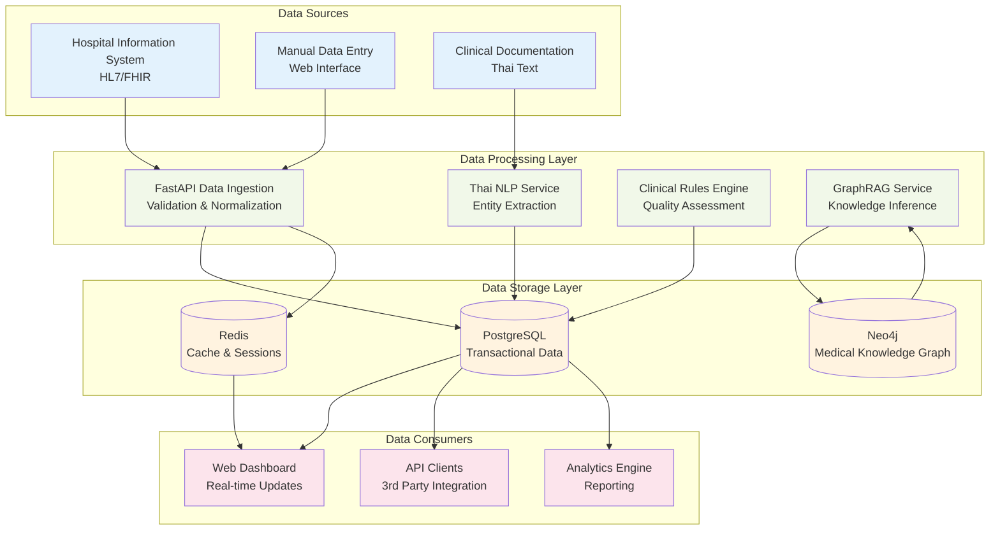

---

## Clinical Decision Support Flow

### Pre-Diagnosis Generation Pipeline

The CDS system processes patient symptoms through a sophisticated GraphRAG knowledge traversal pipeline.

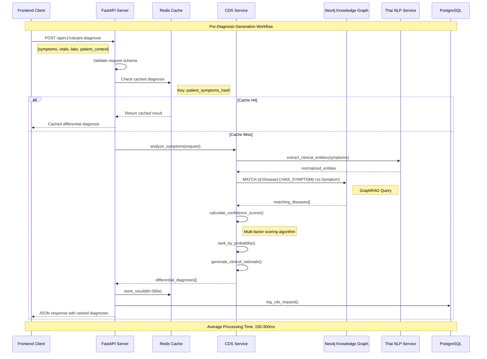

### Order Suggestion Generation

CPG-compliant order suggestions are generated using template-based personalization.

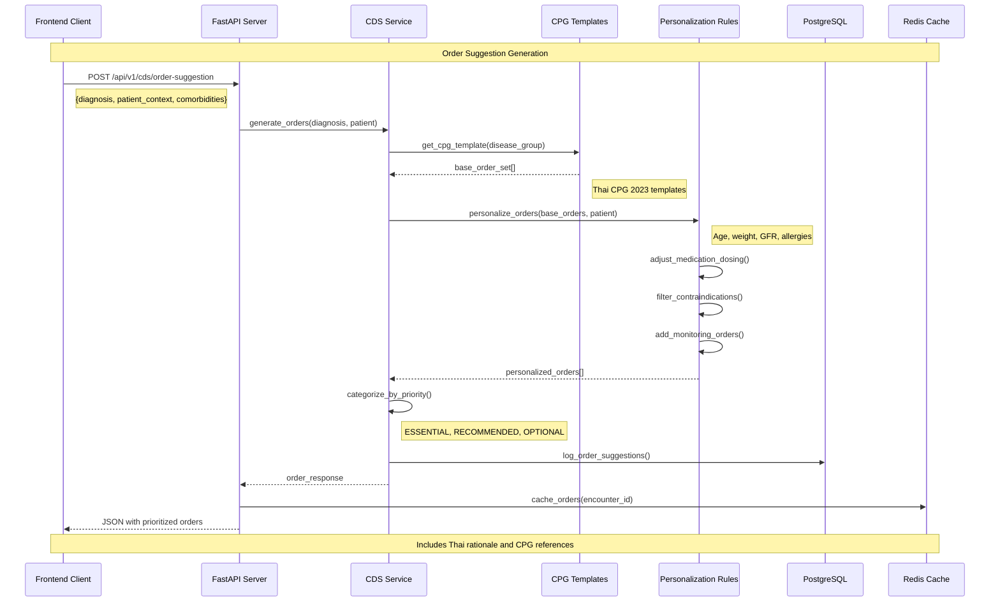

### Admission Decision Calculation

Risk stratification using validated clinical scoring systems.

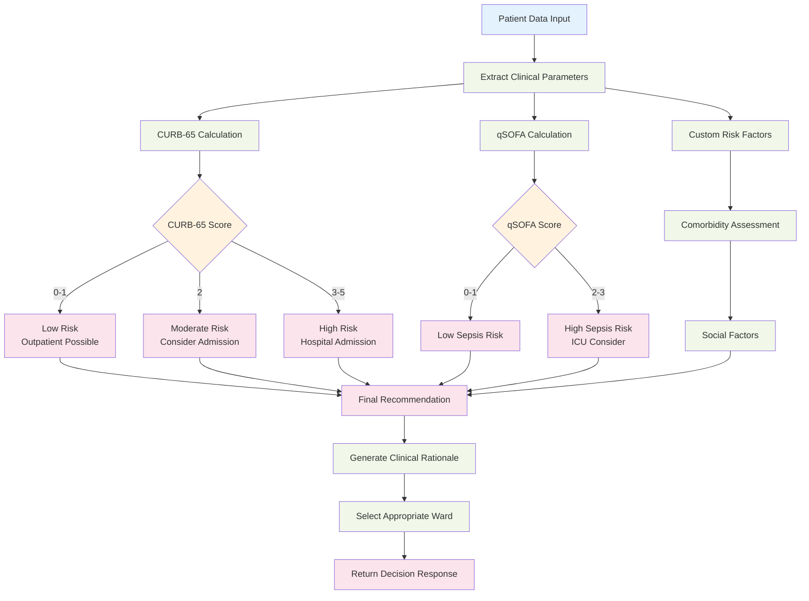

---

## Chart Completeness Processing

### Multi-Dimensional Quality Assessment

Chart completeness evaluation uses a sophisticated rule engine with 20+ configurable rules.

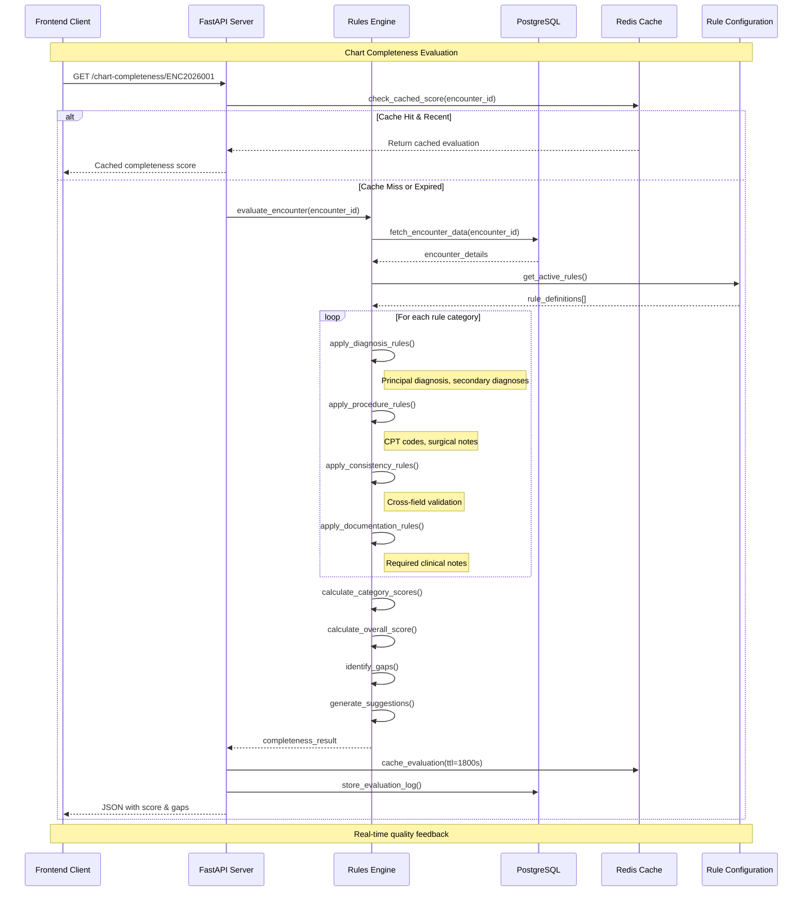

### Rule Engine Processing Flow

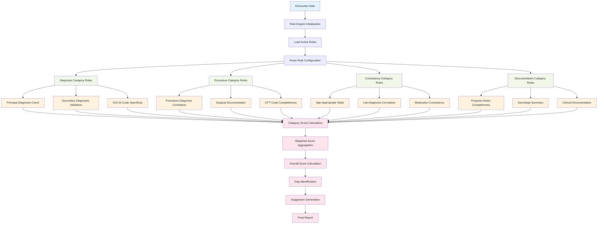

---

## Code Suggestion Pipeline

### AI-Powered ICD-10 Code Generation

The code suggestion system combines NLP analysis with DRG impact calculation.

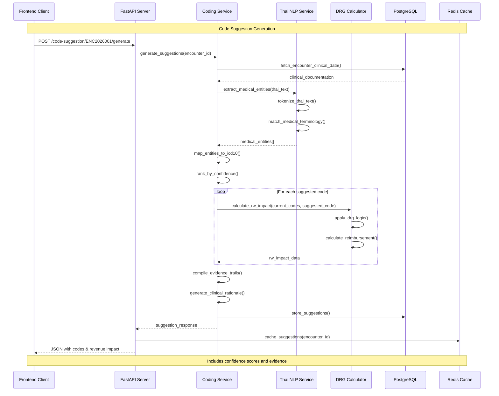

### DRG Impact Calculation Flow

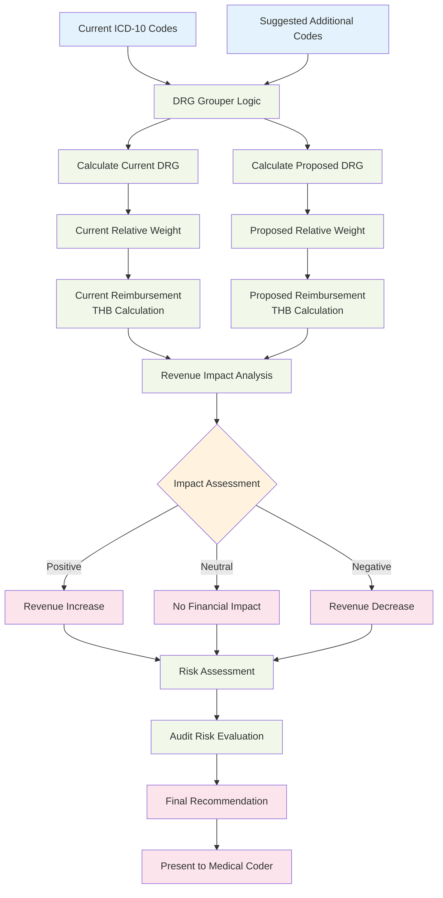

---

## Knowledge Graph Integration

### Medical Knowledge Graph Structure

The Neo4j knowledge graph stores medical relationships and enables GraphRAG queries.

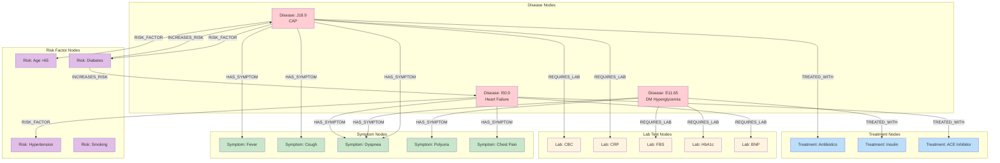

### GraphRAG Query Processing

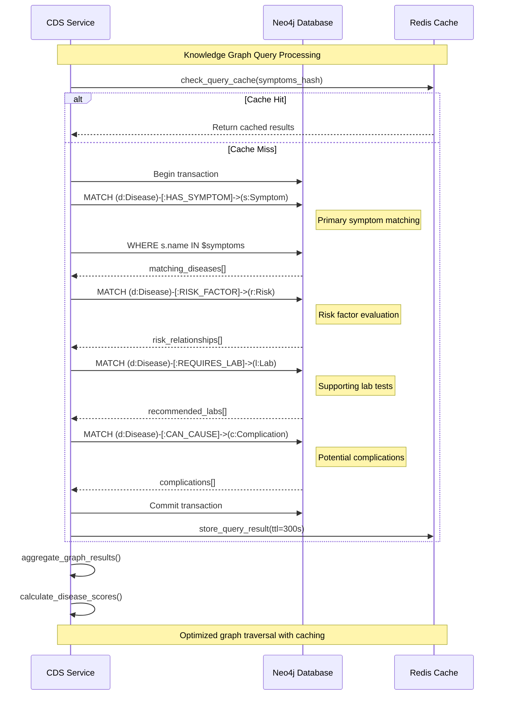

---

## Real-time Processing

### WebSocket Data Streaming

For real-time dashboard updates and live chart completeness scoring.

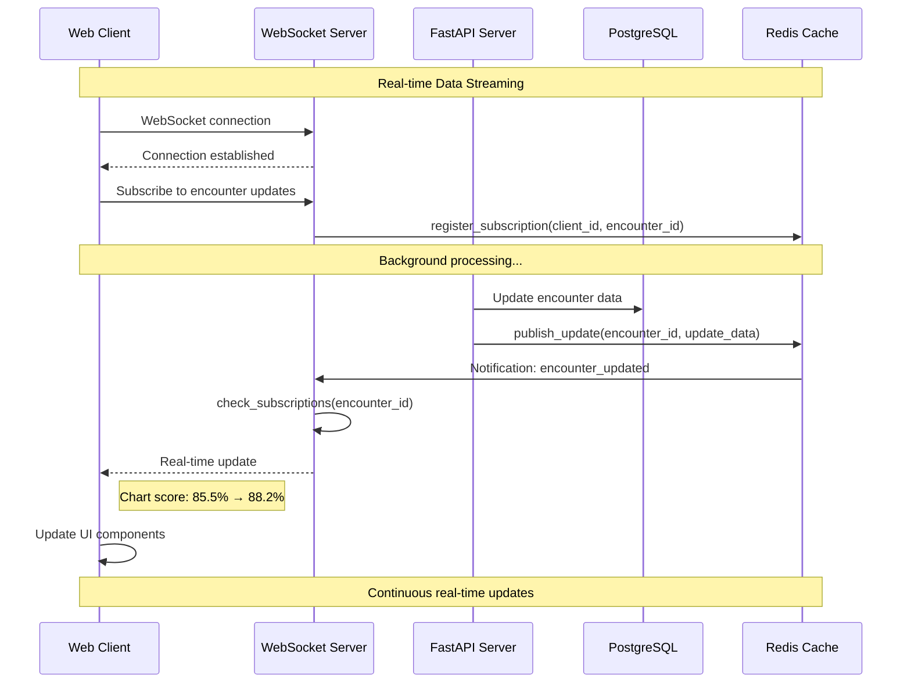

### Event-Driven Architecture

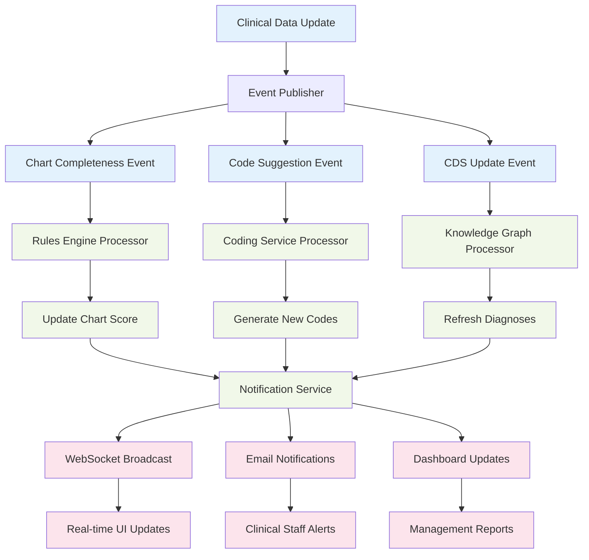

---

## Data Persistence Patterns

### Multi-Database Data Distribution

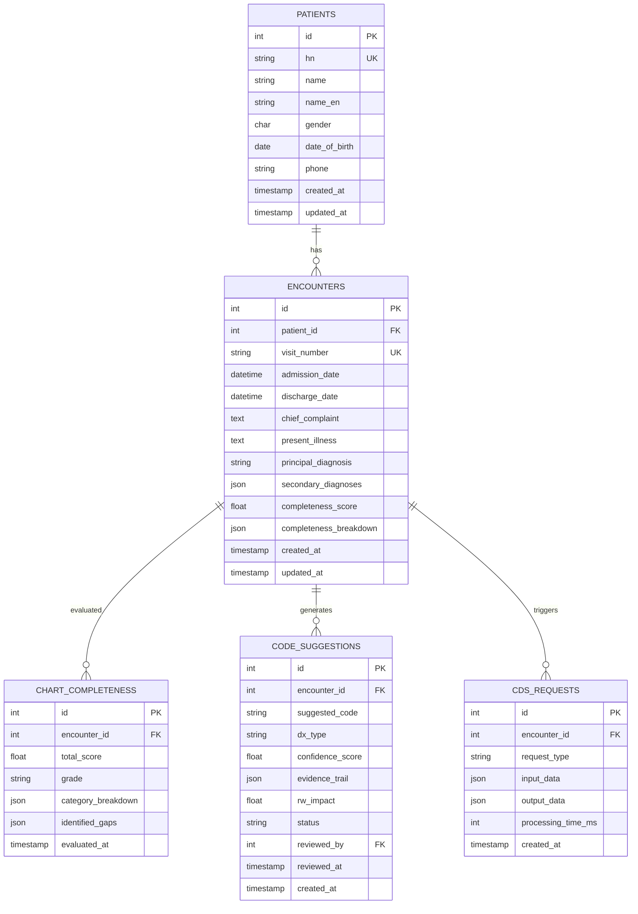

### Caching Strategy

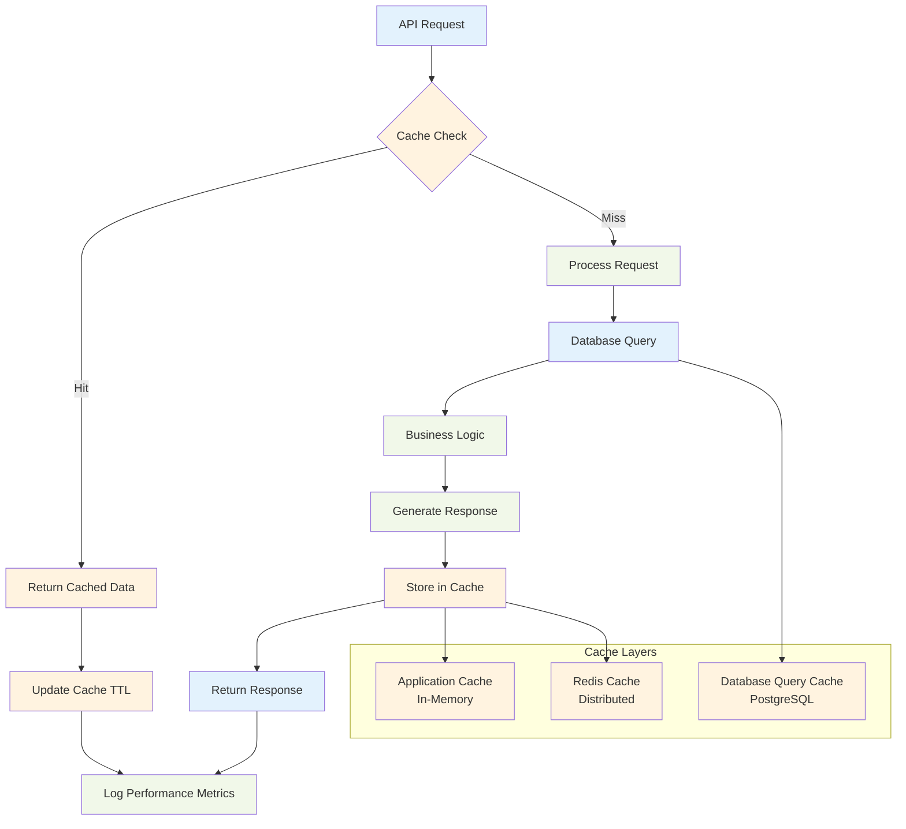

### Data Lifecycle Management

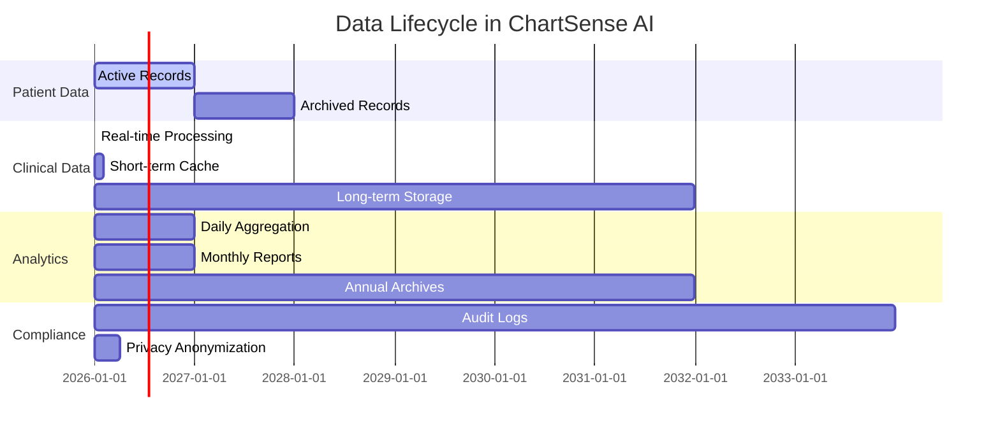

---

## Performance Optimization

### Query Optimization Patterns

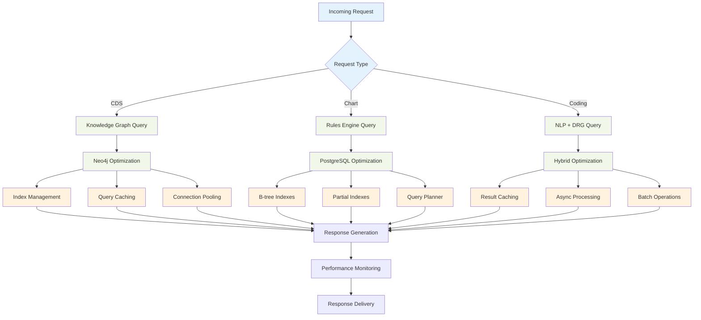

---

*This data flow documentation provides comprehensive insight into ChartSense AI's data processing pipelines. For implementation details, see the [Modules Documentation](MODULES.md) and [Setup Guide](SETUP.md).*

---

**Last Updated**: February 15, 2026  
**Data Flow Version**: 1.0.0-MVP  
**Average Processing Time**: 150-300ms per request