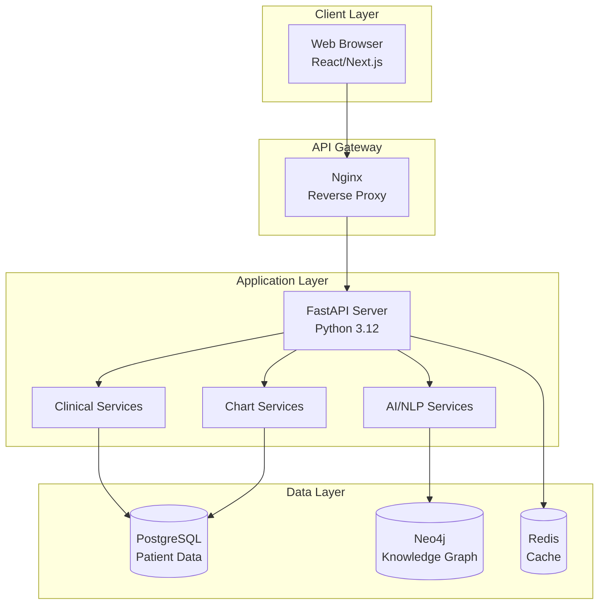

# ChartSense AI Code Wiki 🏥🤖

**AI-Powered Clinical Decision Support Platform for Thai Hospitals**  
*Complete Technical Documentation & Code Reference*

---

## 📚 Navigation

### Core Documentation
- [**🏗️ Architecture**](ARCHITECTURE.md) — System design & architecture diagrams
- [**🧩 Modules**](MODULES.md) — Detailed code analysis & file references
- [**📡 API Reference**](API_REFERENCE.md) — Complete API documentation
- [**🔄 Data Flow**](DATA_FLOW.md) — Data pipelines & sequence diagrams
- [**⚙️ Setup**](SETUP.md) — Development environment & deployment
- [**🔧 Configuration**](CONFIGURATION.md) — Environment variables & settings
- [**📦 Dependencies**](DEPENDENCIES.md) — External libraries & rationale

### Diagrams
- [**Architecture Diagram**](diagrams/architecture.mmd)
- [**Data Flow Diagrams**](diagrams/data-flow.mmd)
- [**API Sequence Diagrams**](diagrams/api-sequences.mmd)

---

## 🎯 Project Overview

ChartSense AI is a comprehensive **Clinical Decision Support (CDS) platform** designed specifically for Thai healthcare institutions. The system combines modern web technologies with AI-driven medical insights to enhance clinical workflows, improve chart quality, and support evidence-based decision making.

### Core Capabilities

#### 🩺 Clinical Decision Support (CDS)
- **Pre-Diagnosis Engine**: GraphRAG-powered differential diagnosis generation with confidence scoring
- **Order Suggestion System**: CPG (Clinical Practice Guidelines)-compliant recommendations for labs, imaging, and medications
- **Admission Decision Support**: Risk stratification using validated scores (CURB-65, qSOFA) with automated recommendations

#### 📊 Chart Completeness Engine
- **Real-time Quality Scoring**: Dynamic 0-100% completeness assessment
- **Multi-dimensional Analysis**: 20+ configurable rules across Diagnosis, Procedure, Consistency, and Documentation dimensions
- **Gap Identification**: Automated detection of missing elements with ICD-10 code suggestions

#### 🔢 AI Code Suggestion
- **ICD-10 Recommendation**: Evidence-based coding suggestions with audit trails
- **DRG/RW Impact Analysis**: Real-time calculation of Relative Weight changes and revenue impact in THB
- **Workflow Integration**: Accept/reject interface for medical coding teams

### Disease Group Coverage (MVP)
- 🫁 **Community-Acquired Pneumonia (CAP)** — Complete diagnostic and treatment pathways
- 💉 **Diabetes Mellitus Complications** — Hyperglycemia, DKA, AKI, Neuropathy management
- ❤️ **Heart Failure** — HFrEF and Acute Decompensated Heart Failure protocols

---

## 🛠️ Technology Stack

### Frontend Stack
| Component | Technology | Version | Purpose |
|-----------|------------|---------|---------|
| **Framework** | Next.js | 14.x | React-based full-stack framework |
| **Language** | TypeScript | 5.x | Type-safe JavaScript development |
| **UI Library** | React | 18.x | Component-based user interface |
| **Styling** | Tailwind CSS | 3.x | Utility-first CSS framework |
| **Components** | shadcn/ui | Latest | Pre-built accessible components |
| **Routing** | App Router | Built-in | Next.js 13+ routing system |

### Backend Stack
| Component | Technology | Version | Purpose |
|-----------|------------|---------|---------|
| **Framework** | FastAPI | 0.115+ | Modern Python web framework |
| **Language** | Python | 3.12 | Core backend language |
| **Database** | PostgreSQL | 16+ | Primary relational database |
| **Graph DB** | Neo4j | 5+ | Knowledge graph storage |
| **Cache** | Redis | 7+ | Session & query caching |
| **ORM** | SQLAlchemy | 2.x | Database abstraction layer |
| **Validation** | Pydantic | 2.x | Data validation & serialization |

### Infrastructure Stack
| Component | Technology | Purpose |
|-----------|------------|---------|
| **Containerization** | Docker + Compose | Service orchestration |
| **Reverse Proxy** | Nginx | Load balancing & routing |
| **Process Manager** | Uvicorn | ASGI server |

### AI & NLP Stack
| Component | Technology | Purpose |
|-----------|------------|---------|
| **Knowledge Graph** | Neo4j GraphRAG | Medical knowledge representation |
| **NLP Engine** | Custom Thai NLP | Keyword extraction & matching |
| **Clinical Rules** | Rule Engine | Chart completeness validation |
| **DRG Calculator** | Custom Service | Revenue impact analysis |

---

## 📊 Project Statistics

### Codebase Metrics
```bash
# Generated from codebase analysis
Lines of Code (Total): ~15,000+
├── Backend (Python): ~8,500 lines
├── Frontend (TypeScript/React): ~6,000 lines
├── Configuration: ~500 lines

File Count: 150+
├── Python files: 45+
├── TypeScript/React files: 30+
├── Configuration files: 25+
├── Documentation: 10+

Components:
├── React Components: 25+
├── API Endpoints: 20+
├── Database Models: 15+
├── Services: 8+
```

### Architecture Overview


---

## 🔍 Key Features Deep Dive

### Clinical Decision Support Workflow
1. **Patient Data Ingestion** → Clinical data normalized and structured
2. **Knowledge Graph Query** → Medical relationships and evidence retrieval  
3. **Risk Stratification** → Validated clinical scores (CURB-65, qSOFA)
4. **Recommendation Generation** → Evidence-based suggestions with confidence scores
5. **Clinical Review** → Physician validation and approval workflow

### Chart Completeness Analysis
1. **Real-time Evaluation** → 20+ configurable rules across 4 dimensions
2. **Gap Detection** → Missing elements identification with severity scoring
3. **ICD-10 Mapping** → Automated code suggestions based on clinical findings
4. **Quality Metrics** → Completeness trends and improvement tracking

### AI Code Suggestion Pipeline
1. **Clinical Entity Extraction** → NLP-based medical concept identification
2. **ICD-10 Matching** → Probabilistic code mapping with evidence trails
3. **DRG Impact Calculation** → Real-time RW changes and revenue analysis
4. **Coding Workflow** → Accept/reject interface with audit logging

---

## 📈 Demo Data & Seed Information

The platform includes comprehensive demo data for evaluation:

- **12 Realistic Patients** with Thai names and authentic clinical histories
- **11 Clinical Encounters** spanning all three disease groups (CAP, DM, HF)
- **20 Chart Completeness Rules** across diagnostic, procedural, consistency, and documentation categories
- **3 CPG Templates** based on Thai Clinical Practice Guidelines 2023
- **Complete Clinical Data** including lab results, vitals, progress notes in Thai language
- **Pre-configured Knowledge Graph** with medical relationships for all disease groups

---

## 🏥 Healthcare Integration

### Thai Healthcare System Compatibility
- **Hospital Information System (HIS)** integration endpoints
- **Thai DRG System** compliance for reimbursement calculations
- **Thai Clinical Practice Guidelines** adherence
- **Thai Language Support** for clinical documentation
- **Regulatory Compliance** with Thai healthcare standards

### Multi-stakeholder Design
- **Physicians** — Clinical decision support and diagnostic assistance
- **Medical Coders** — Automated code suggestions and DRG optimization
- **Quality Managers** — Chart completeness monitoring and improvement
- **Hospital Administrators** — Revenue impact analysis and operational metrics

---

## 🤝 Contributing

This codebase follows modern development practices:
- **Conventional Commits** for standardized commit messages
- **TypeScript** for frontend type safety
- **Python Type Hints** for backend code clarity
- **Comprehensive Testing** with unit and integration test coverage
- **Docker-first Development** for environment consistency
- **API-first Design** with OpenAPI/Swagger documentation

---

## ⚠️ Important Disclaimers

This is an **MVP/Demo Application** designed for:
- Educational and research purposes
- Technology demonstration
- Clinical workflow prototyping

**NOT intended for production clinical use** without:
- Comprehensive clinical validation
- Regulatory approval (FDA, Thai FDA equivalent)
- Medical oversight and governance
- Security audits and HIPAA compliance
- Integration testing with hospital systems

---

*This wiki serves as the comprehensive technical documentation for ChartSense AI. Navigate using the links above to explore specific aspects of the system architecture, implementation, and deployment.*

---

**Last Updated**: February 15, 2026  
**Version**: 1.0.0-MVP  
**Maintainer**: Development Team